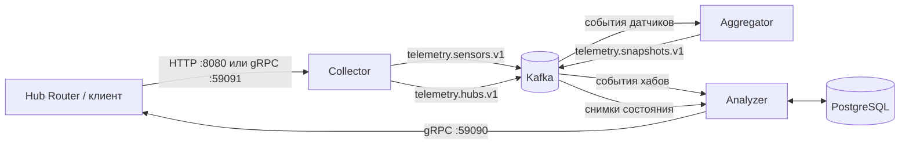

# Smart Home Tech

Учебная система обработки телеметрии умного дома. Проект принимает события датчиков и хабов по HTTP или gRPC, передаёт их через Kafka, формирует актуальные снимки состояния устройств, проверяет пользовательские сценарии и отправляет команды на их выполнение в Hub Router.

## Архитектура



Поток обработки:

1. **Collector** принимает события по REST или gRPC, преобразует их в Avro и публикует в Kafka.
2. **Aggregator** читает события датчиков и хранит в памяти последнее состояние каждого датчика внутри хаба.
3. При изменении состояния Aggregator публикует новый снимок хаба в `telemetry.snapshots.v1`.
4. **Analyzer** читает события хабов, сохраняет датчики и сценарии в PostgreSQL, а затем сопоставляет снимки с условиями сценариев.
5. Когда все условия сценария выполнены, Analyzer отправляет действие в Hub Router по gRPC.

## Модули

| Модуль | Назначение |
|---|---|
| `telemetry/collector` | REST- и gRPC-приём событий, преобразование в Avro, публикация в Kafka |
| `telemetry/aggregator` | Агрегация последних состояний датчиков и формирование снимков хабов |
| `telemetry/analyzer` | Хранение сценариев, анализ снимков и отправка команд устройствам |
| `telemetry/serialization/avro-schemas` | Avro-схемы событий Kafka, сериализаторы и десериализаторы |
| `telemetry/serialization/proto-schemas` | Protobuf-сообщения и контракты gRPC |
| `hub-router` | Предоставленная тестовая утилита для проверки отдельных этапов и полного контура |
| `infra`, `commerce` | Зарезервированные Maven-модули для следующих частей проекта |

## Технологии

- Java 21
- Spring Boot 3.3.2
- Apache Kafka 3.6.1
- Apache Avro 1.11.3
- gRPC 1.63.0 и Protocol Buffers 3.23.4
- Spring Data JPA и Hibernate
- PostgreSQL 16
- Maven
- Docker Compose
- Lombok

## Kafka-топики

| Топик | Производитель | Потребитель | Содержимое |
|---|---|---|---|
| `telemetry.sensors.v1` | Collector | Aggregator | События датчиков `SensorEventAvro` |
| `telemetry.hubs.v1` | Collector | Analyzer | Добавление и удаление устройств и сценариев |
| `telemetry.snapshots.v1` | Aggregator | Analyzer | Актуальные снимки состояния хабов |

Для всех топиков в локальном окружении создаётся по одной партиции с коэффициентом репликации `1`.

## Поддерживаемые данные

### Датчики

- движение;
- температура;
- освещённость;
- климат: температура, влажность и уровень CO₂;
- переключатель.

### Условия сценария

Типы значений:

- `MOTION`
- `LUMINOSITY`
- `SWITCH`
- `TEMPERATURE`
- `CO2LEVEL`
- `HUMIDITY`

Операции сравнения:

- `EQUALS`
- `GREATER_THAN`
- `LOWER_THAN`

### Действия

- `ACTIVATE`
- `DEACTIVATE`
- `INVERSE`
- `SET_VALUE`

## Требования

Перед запуском установите:

- JDK 21;
- Maven;
- Docker с поддержкой Docker Compose.

Проверка окружения:

```bash
java -version
mvn -version
docker --version
docker compose version
```

## Локальный запуск

### 1. Запустить инфраструктуру

Из корня проекта:

```bash
docker compose up -d
```

Будут запущены:

| Компонент | Адрес |
|---|---|
| Kafka | `localhost:9092` |
| Kafka JMX | `localhost:9101` |
| PostgreSQL | `localhost:5433` |

Параметры локальной базы:

```text
Database: analyzer_db
User: postgres
Password: postgres
```

Проверка контейнеров:

```bash
docker compose ps
```

### 2. Собрать проект

```bash
mvn clean package
```

### 3. Запустить сервисы

Откройте для каждого приложения отдельный терминал.

**Collector**

```bash
java -jar telemetry/collector/target/collector-1.0-SNAPSHOT.jar
```

**Aggregator**

```bash
java -jar telemetry/aggregator/target/aggregator-1.0-SNAPSHOT.jar
```

**Analyzer**

```bash
java -jar telemetry/analyzer/target/analyzer-1.0-SNAPSHOT.jar
```

Основные порты:

| Сервис | Интерфейс | Порт |
|---|---|---:|
| Collector | HTTP | `8080` |
| Collector | gRPC | `59091` |
| Hub Router | gRPC-приём действий | `59090` |

> Analyzer должен иметь доступ к Hub Router на `localhost:59090`. Если сценарий сработает при незапущенном Hub Router, Analyzer получит `Connection refused` и повторно прочитает Kafka-сообщение после следующего опроса.

## API Collector

### REST

#### Событие датчика

```http
POST /events/sensors
Content-Type: application/json
```

Пример события датчика движения:

```json
{
  "id": "motion-1",
  "hubId": "hub-1",
  "timestamp": "2026-08-04T12:00:00Z",
  "type": "MOTION_SENSOR_EVENT",
  "linkQuality": 95,
  "motion": true,
  "voltage": 220
}
```

#### Событие хаба

```http
POST /events/hubs
Content-Type: application/json
```

Сначала устройство нужно зарегистрировать:

```json
{
  "hubId": "hub-1",
  "timestamp": "2026-08-04T12:00:00Z",
  "type": "DEVICE_ADDED",
  "id": "motion-1",
  "deviceType": "MOTION_SENSOR"
}
```

Пример сценария:

```json
{
  "hubId": "hub-1",
  "timestamp": "2026-08-04T12:01:00Z",
  "type": "SCENARIO_ADDED",
  "name": "Turn on light when motion is detected",
  "conditions": [
    {
      "sensorId": "motion-1",
      "type": "MOTION",
      "operation": "EQUALS",
      "value": true
    }
  ],
  "actions": [
    {
      "sensorId": "switch-1",
      "type": "ACTIVATE"
    }
  ]
}
```

Все датчики, использованные в условиях и действиях сценария, должны быть заранее зарегистрированы в том же хабе.

### gRPC

Collector поднимает сервис `CollectorController` на порту `59091` с двумя методами:

```text
CollectSensorEvent(SensorEventProto)
CollectHubEvent(HubEventProto)
```

Контракты находятся в:

```text
telemetry/serialization/proto-schemas/src/main/protobuf
```

## Хранение сценариев

Analyzer использует PostgreSQL и при запуске применяет `schema.sql`. В базе создаются таблицы:

- `sensors`
- `scenarios`
- `conditions`
- `actions`
- `scenario_conditions`
- `scenario_actions`

Триггеры базы запрещают связывать сценарий и датчик, принадлежащие разным хабам.

Состояния датчиков в Aggregator хранятся **в памяти**. После перезапуска Aggregator снимки будут собираться заново из новых Kafka-событий.

## Конфигурация

### Aggregator

Значения можно переопределить переменными окружения:

| Переменная | Значение по умолчанию |
|---|---|
| `AGGREGATOR_KAFKA_BOOTSTRAP_SERVERS` | `localhost:9092` |
| `AGGREGATOR_KAFKA_CONSUMER_CLIENT_ID` | `aggregator-consumer` |
| `AGGREGATOR_KAFKA_CONSUMER_GROUP_ID` | `aggregator-group` |
| `AGGREGATOR_KAFKA_CONSUMER_TOPIC` | `telemetry.sensors.v1` |
| `AGGREGATOR_KAFKA_CONSUMER_AUTO_OFFSET_RESET` | `earliest` |
| `AGGREGATOR_KAFKA_CONSUMER_ENABLE_AUTO_COMMIT` | `false` |
| `AGGREGATOR_KAFKA_CONSUMER_MAX_POLL_RECORDS` | `100` |
| `AGGREGATOR_KAFKA_CONSUMER_POLL_TIMEOUT_MS` | `1000` |
| `AGGREGATOR_KAFKA_PRODUCER_CLIENT_ID` | `aggregator-producer` |
| `AGGREGATOR_KAFKA_PRODUCER_TOPIC` | `telemetry.snapshots.v1` |
| `AGGREGATOR_KAFKA_PRODUCER_ACKS` | `all` |
| `AGGREGATOR_KAFKA_PRODUCER_RETRIES` | `5` |
| `AGGREGATOR_KAFKA_PRODUCER_ENABLE_IDEMPOTENCE` | `true` |

Остальные настройки находятся в файлах:

```text
telemetry/collector/src/main/resources/application.yml
telemetry/aggregator/src/main/resources/application.yml
telemetry/analyzer/src/main/resources/application.yml
```

Spring Boot также позволяет переопределять их стандартными внешними параметрами конфигурации.

## Тестирование

### Модульные тесты и сборка

```bash
mvn clean test
```

### Полная интеграционная проверка

Перед запуском должны работать Kafka, PostgreSQL, Collector, Aggregator и Analyzer.

Windows:

```powershell
.\hub-router\scripts\windows\4-analyzer-tests.bat
```

macOS/Linux:

```bash
bash ./hub-router/scripts/macos_linux/4-analyzer-tests.sh
```

Также доступны отдельные сценарии проверки:

| Этап | Windows | macOS/Linux |
|---|---|---|
| Collector через HTTP | `1-collector-json-tests.bat` | `1-collector-json-tests.sh` |
| Collector через gRPC | `2-collector-grpc-tests.bat` | `2-collector-grpc-tests.sh` |
| Collector + Aggregator | `3-aggregator-tests.bat` | `3-aggregator-tests.sh` |
| Полный контур | `4-analyzer-tests.bat` | `4-analyzer-tests.sh` |

Обёртки `hub-router/run-tests.bat` и `hub-router/run-tests.sh` выбирают тест по названию учебной ветки. На `main` удобнее запускать нужный скрипт напрямую.

## Остановка и очистка

Остановите Java-процессы сочетанием `Ctrl+C`, затем выполните:

```bash
docker compose down
```

Полный сброс локального окружения:

```bash
docker compose down -v --remove-orphans
```

## Структура проекта

```text
plus-smart-home-tech/
├── telemetry/
│   ├── collector/
│   ├── aggregator/
│   ├── analyzer/
│   └── serialization/
│       ├── avro-schemas/
│       └── proto-schemas/
├── hub-router/
├── infra/
├── commerce/
├── compose.yaml
└── pom.xml
```

## CI

Для Pull Request настроен GitHub Actions workflow `.github/workflows/api-tests.yml`, который запускает проверочный workflow Яндекс Практикума.
