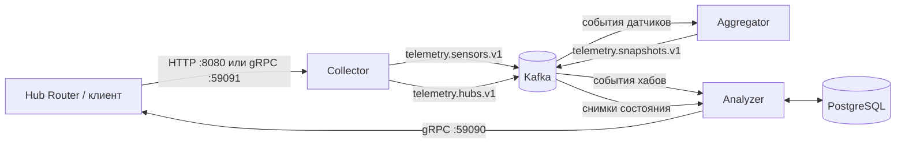
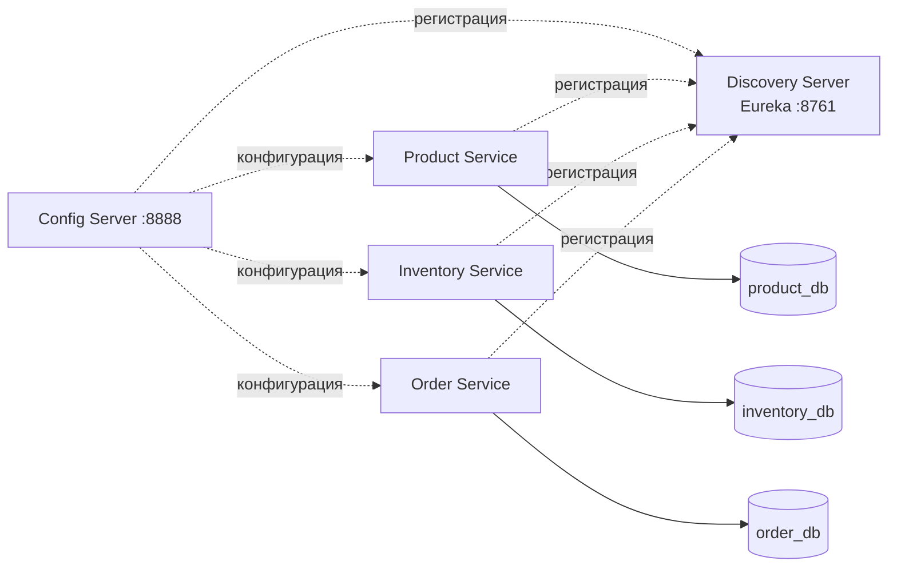

# Smart Home Tech

Учебный микросервисный проект системы умного дома и интернет-магазина устройств.

Проект состоит из двух основных частей:

- **Telemetry** — принимает события датчиков и хабов по HTTP или gRPC, передаёт их через Kafka, формирует актуальные снимки состояния устройств, проверяет пользовательские сценарии и отправляет команды на их выполнение в Hub Router.
- **Commerce** — реализует каталог товаров, складские остатки и заказы. Для централизованной конфигурации и обнаружения сервисов используются Spring Cloud Config и Eureka.

## Архитектура

### Telemetry



Поток обработки:

1. **Collector** принимает события по REST или gRPC, преобразует их в Avro и публикует в Kafka.
2. **Aggregator** читает события датчиков и хранит последнее состояние каждого датчика внутри хаба.
3. При изменении состояния Aggregator публикует новый снимок хаба в `telemetry.snapshots.v1`.
4. **Analyzer** читает события хабов, сохраняет датчики и сценарии в PostgreSQL и сопоставляет снимки с условиями сценариев.
5. Когда все условия сценария выполнены, Analyzer отправляет действие в Hub Router по gRPC.

### Commerce



Commerce-сервисы используют подход **Database per Service**: каждый сервис владеет собственной базой данных и не обращается напрямую к данным другого сервиса.

На текущем этапе `product-service`, `inventory-service` и `order-service` также не выполняют бизнес-вызовы друг к другу.

## Модули

| Модуль | Назначение |
|---|---|
| `telemetry/collector` | REST- и gRPC-приём событий, преобразование в Avro и публикация в Kafka |
| `telemetry/aggregator` | Агрегация состояний датчиков и формирование снимков хабов |
| `telemetry/analyzer` | Хранение сценариев, анализ снимков и отправка команд устройствам |
| `telemetry/serialization/avro-schemas` | Avro-схемы событий Kafka |
| `telemetry/serialization/proto-schemas` | Protobuf-сообщения и контракты gRPC |
| `infra/config-server` | Централизованная конфигурация Spring Cloud Config |
| `infra/discovery-server` | Eureka Server для регистрации и обнаружения сервисов |
| `infra/config-repo` | Внешние конфигурации сервисов |
| `commerce/product-service` | Каталог товаров и категорий |
| `commerce/inventory-service` | Складские остатки и резервирование товаров |
| `commerce/order-service` | Создание и хранение заказов |
| `hub-router` | Тестовая утилита для проверки telemetry-контура |

## Технологии

- Java 21
- Spring Boot 3.3.2
- Spring Cloud Config
- Netflix Eureka
- Spring Data JPA и Hibernate
- PostgreSQL 16
- Apache Kafka 3.6.1
- Apache Avro 1.11.3
- gRPC 1.63.0
- Protocol Buffers 3.23.4
- Maven
- Docker Compose
- Lombok

## Telemetry

### Kafka-топики

| Топик | Производитель | Потребитель | Содержимое |
|---|---|---|---|
| `telemetry.sensors.v1` | Collector | Aggregator | События датчиков `SensorEventAvro` |
| `telemetry.hubs.v1` | Collector | Analyzer | Добавление и удаление устройств и сценариев |
| `telemetry.snapshots.v1` | Aggregator | Analyzer | Актуальные снимки состояния хабов |

В локальном окружении для каждого топика создаётся одна партиция с коэффициентом репликации `1`.

### Поддерживаемые данные

#### Датчики

- движение;
- температура;
- освещённость;
- климат: температура, влажность и уровень CO₂;
- переключатель.

#### Условия сценария

Типы значений:

- `MOTION`
- `LUMINOSITY`
- `SWITCH`
- `TEMPERATURE`
- `CO2LEVEL`
- `HUMIDITY`

Операции:

- `EQUALS`
- `GREATER_THAN`
- `LOWER_THAN`

#### Действия

- `ACTIVATE`
- `DEACTIVATE`
- `INVERSE`
- `SET_VALUE`

### API Collector

#### REST

Событие датчика:

```http
POST /events/sensors
Content-Type: application/json
```

Пример:

```json
{
  "id": "motion-1",
  "hubId": "hub-1",
  "timestamp": "2026-08-04T12:00:00Z",
  "type": "MOTION_SENSOR_EVENT",
  "linkQuality": 95,
  "motion": true,
  "voltage": 220
}
```

Событие хаба:

```http
POST /events/hubs
Content-Type: application/json
```

Пример регистрации устройства:

```json
{
  "hubId": "hub-1",
  "timestamp": "2026-08-04T12:00:00Z",
  "type": "DEVICE_ADDED",
  "id": "motion-1",
  "deviceType": "MOTION_SENSOR"
}
```

Пример сценария:

```json
{
  "hubId": "hub-1",
  "timestamp": "2026-08-04T12:01:00Z",
  "type": "SCENARIO_ADDED",
  "name": "Turn on light when motion is detected",
  "conditions": [
    {
      "sensorId": "motion-1",
      "type": "MOTION",
      "operation": "EQUALS",
      "value": true
    }
  ],
  "actions": [
    {
      "sensorId": "switch-1",
      "type": "ACTIVATE"
    }
  ]
}
```

Датчики, используемые в условиях и действиях сценария, должны быть заранее зарегистрированы в том же хабе.

#### gRPC

Collector поднимает сервис `CollectorController` на порту `59091` с двумя методами:

```text
CollectSensorEvent(SensorEventProto)
CollectHubEvent(HubEventProto)
```

Контракты находятся в:

```text
telemetry/serialization/proto-schemas/src/main/protobuf
```

### Хранение сценариев

Analyzer использует PostgreSQL и при запуске применяет `schema.sql`.

Основные таблицы:

- `sensors`
- `scenarios`
- `conditions`
- `actions`
- `scenario_conditions`
- `scenario_actions`

Триггеры базы запрещают связывать сценарий и датчик, принадлежащие разным хабам.

Состояния датчиков в Aggregator хранятся **в памяти**. После перезапуска снимки собираются заново из новых Kafka-событий.

## Commerce

### Product Service

`product-service` отвечает за каталог товаров и категории.

Поддерживаются:

- создание категорий;
- получение списка категорий;
- получение категории по ID;
- создание товаров;
- получение активных товаров;
- получение товара по ID;
- получение товаров по категории;
- поиск товаров по названию;
- частичное обновление товара;
- хранение активных и неактивных товаров.

Категория товара является необязательной.

База данных: `product_db`.

### Inventory Service

`inventory-service` отвечает за складские остатки и резервирование товаров.

Поддерживаются:

- создание складской записи;
- получение всех складских записей;
- получение остатка по ID товара;
- изменение количества товара;
- расчёт доступного количества;
- резервирование товара;
- проверка недостаточного остатка;
- optimistic locking (оптимистическая блокировка).

Доступное количество:

```text
availableQuantity = quantity - reservedQuantity
```

База данных: `inventory_db`.

### Order Service

`order-service` отвечает за работу с заказами.

Поддерживаются:

- создание заказа;
- получение заказа по ID;
- получение всех заказов;
- поиск заказов по email покупателя;
- автоматический расчёт общей стоимости заказа.

При создании заказа сохраняется снимок данных товара (snapshot):

- ID товара;
- название;
- количество;
- цена.

Общая стоимость рассчитывается как сумма `quantity × price`.

Новый заказ создаётся со статусом `CREATED`.

База данных: `order_db`.

### Database per Service

| Сервис | База данных | Локальный порт |
|---|---|---:|
| `product-service` | `product_db` | `5434` |
| `inventory-service` | `inventory_db` | `5435` |
| `order-service` | `order_db` | `5436` |

Один сервис не обращается напрямую к базе данных другого сервиса.

### Config Server

`config-server` предоставляет централизованную конфигурацию приложениям и работает на порту `8888`.

Конфигурации находятся в:

```text
infra/config-repo
```

Конфигурации commerce-сервисов:

```text
infra/config-repo/commerce
```

Локальный `application.yml` commerce-сервиса содержит имя приложения и подключение к Config Server:

```yaml
spring:
  application:
    name: product-service
  config:
    import: configserver:http://localhost:8888
```

Параметры PostgreSQL и Eureka находятся во внешнем Config Repository.

### Discovery Server

`discovery-server` работает как Eureka Server на порту `8761`.

Eureka Dashboard:

```text
http://localhost:8761
```

Config Server и commerce-сервисы регистрируются в Eureka.

Commerce-сервисы используют динамические HTTP-порты:

```yaml
server:
  port: 0
```

После запуска в Eureka должны быть зарегистрированы:

```text
CONFIG-SERVER
PRODUCT-SERVICE
INVENTORY-SERVICE
ORDER-SERVICE
```

## Требования

Перед запуском необходимы:

- JDK 21;
- Maven;
- Docker с поддержкой Docker Compose.

Проверка окружения:

```bash
java -version
mvn -version
docker --version
docker compose version
```

## Локальный запуск

### 1. Запустить инфраструктуру

Из корня проекта:

```bash
docker compose up -d
```

Проверить контейнеры:

```bash
docker compose ps
```

PostgreSQL:

| Назначение | База данных | Порт |
|---|---|---:|
| Analyzer | `analyzer_db` | `5433` |
| Product Service | `product_db` | `5434` |
| Inventory Service | `inventory_db` | `5435` |
| Order Service | `order_db` | `5436` |

Kafka:

```text
localhost:9092
```

### 2. Собрать проект

```bash
mvn clean package
```

### 3. Запустить Discovery Server

```bash
java -jar infra/discovery-server/target/discovery-server-1.0-SNAPSHOT.jar
```

### 4. Запустить Config Server

```bash
java -jar infra/config-server/target/config-server-1.0-SNAPSHOT.jar
```

### 5. Запустить Commerce

Для каждого сервиса используйте отдельный терминал:

```bash
java -jar commerce/product-service/target/product-service-1.0-SNAPSHOT.jar
```

```bash
java -jar commerce/inventory-service/target/inventory-service-1.0-SNAPSHOT.jar
```

```bash
java -jar commerce/order-service/target/order-service-1.0-SNAPSHOT.jar
```

### 6. Запустить Telemetry

Collector:

```bash
java -jar telemetry/collector/target/collector-1.0-SNAPSHOT.jar
```

Aggregator:

```bash
java -jar telemetry/aggregator/target/aggregator-1.0-SNAPSHOT.jar
```

Analyzer:

```bash
java -jar telemetry/analyzer/target/analyzer-1.0-SNAPSHOT.jar
```

Основные порты:

| Сервис | Интерфейс | Порт |
|---|---|---:|
| Collector | HTTP | `8080` |
| Collector | gRPC | `59091` |
| Hub Router | gRPC | `59090` |

> Analyzer должен иметь доступ к Hub Router на `localhost:59090`.

## Тестирование

### Тесты проекта

```bash
mvn clean test
```

### Acceptance-тесты Commerce

```bash
mvn -pl commerce/product-service,commerce/inventory-service,commerce/order-service test
```

### Интеграционная проверка Telemetry

Перед проверкой должны работать Kafka, PostgreSQL, Collector, Aggregator и Analyzer.

Windows:

```powershell
.\hub-router\scripts\windows\4-analyzer-tests.bat
```

macOS/Linux:

```bash
bash ./hub-router/scripts/macos_linux/4-analyzer-tests.sh
```

Доступные сценарии:

| Этап | Windows | macOS/Linux |
|---|---|---|
| Collector через HTTP | `1-collector-json-tests.bat` | `1-collector-json-tests.sh` |
| Collector через gRPC | `2-collector-grpc-tests.bat` | `2-collector-grpc-tests.sh` |
| Collector + Aggregator | `3-aggregator-tests.bat` | `3-aggregator-tests.sh` |
| Полный контур | `4-analyzer-tests.bat` | `4-analyzer-tests.sh` |

## Конфигурация

### Telemetry

```text
telemetry/collector/src/main/resources/application.yml
telemetry/aggregator/src/main/resources/application.yml
telemetry/analyzer/src/main/resources/application.yml
```

### Commerce

Локальные конфигурации:

```text
commerce/product-service/src/main/resources/application.yml
commerce/inventory-service/src/main/resources/application.yml
commerce/order-service/src/main/resources/application.yml
```

Внешние конфигурации:

```text
infra/config-repo/commerce/product-service.yml
infra/config-repo/commerce/inventory-service.yml
infra/config-repo/commerce/order-service.yml
```

Общая внешняя конфигурация:

```text
infra/config-repo/application.yml
```

## Остановка и очистка

Остановите Java-процессы через `Ctrl+C`, затем:

```bash
docker compose down
```

Полный сброс локального окружения:

```bash
docker compose down -v --remove-orphans
```

## Структура проекта

```text
plus-smart-home-tech/
├── telemetry/
│   ├── collector/
│   ├── aggregator/
│   ├── analyzer/
│   └── serialization/
│       ├── avro-schemas/
│       └── proto-schemas/
│
├── commerce/
│   ├── product-service/
│   ├── inventory-service/
│   └── order-service/
│
├── infra/
│   ├── config-server/
│   ├── discovery-server/
│   └── config-repo/
│       └── commerce/
│
├── hub-router/
├── compose.yaml
└── pom.xml
```

## CI

Для Pull Request настроен GitHub Actions workflow `.github/workflows/api-tests.yml`, который запускает проверочный workflow Яндекс Практикума.
